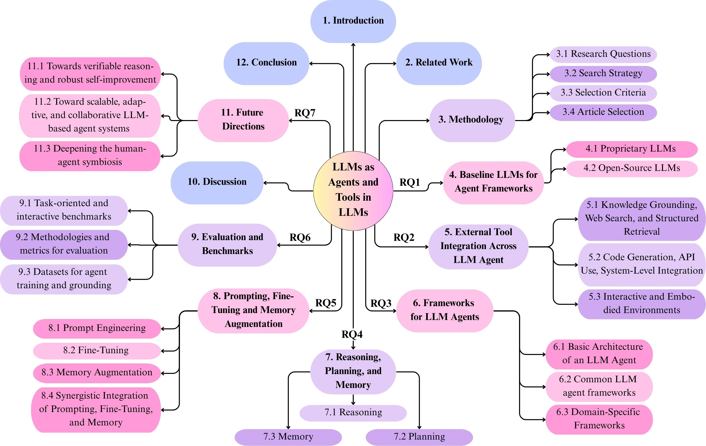
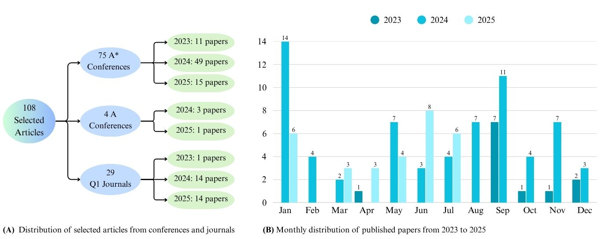
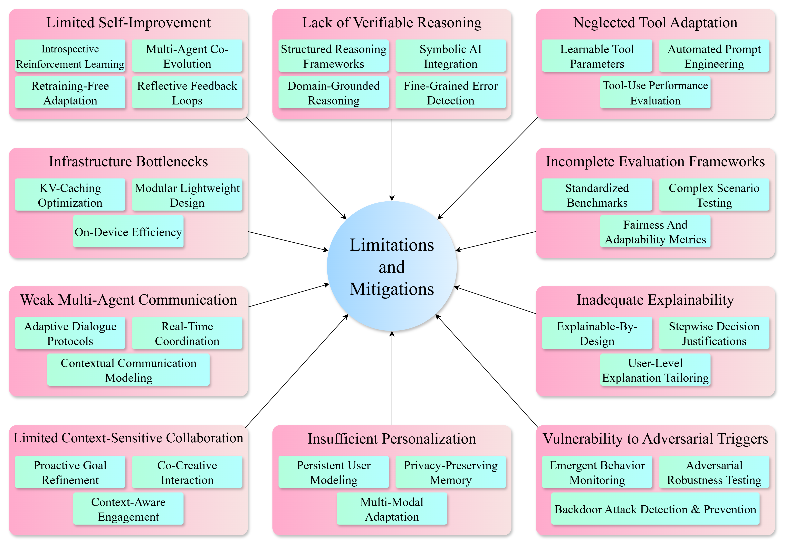

# From Language to Action: A Review of Large Language Models as Autonomous Agents and Tool Users

[](https://arxiv.org/abs/2508.17281)

<div align="center">
  
</div>
<p align="center"><em>An overview of the taxonomy used in this review.</em></p>

## 📋 Abstract

The pursuit of human-level artificial intelligence (AI) has significantly advanced the development of autonomous agents and Large Language Models (LLMs). LLMs are now widely utilized as decision-making agents for their ability to interpret instructions, manage sequential tasks, and adapt through feedback. This review examines recent developments in employing LLMs as autonomous agents and tool users and comprises seven research questions. We only used the papers published between 2023 and 2025 in conferences of the A* and A-ranked and Q1 journals. A structured analysis of the LLM agents’ architectural design principles, dividing their applications into single-agent and multi-agent systems, and strategies for integrating external tools is presented. In addition, the cognitive mechanisms of LLMs, including reasoning, planning, and memory, and the impact of prompting methods and fine-tuning procedures on agent performance are also investigated. Furthermore, we have evaluated current benchmarks and assessment protocols and provided an analysis of 68 publicly available datasets to assess the performance of LLM-based agents in various tasks. In conducting this review, we have identified critical findings on verifiable reasoning of LLMs, the capacity for self-improvement, and the personalization of LLM-based agents. Finally, we have discussed ten future research directions to overcome these gaps.

**Authors:**  
Sadia Sultana Chowa¹,*, Riasad Alvi², Subhey Sadi Rahman², Md Abdur Rahman², Mohaimenul Azam Khan Raiaan²,*, Md Rafiqul Islam³, Mukhtar Hussain³, Sami Azam³,*

¹ *Department of Computer Science and Engineering, Daffodil International University, Bangladesh*  
² *Department of Computer Science and Engineering, United International University, Bangladesh*  
³ *Faculty of Science and Technology, Charles Darwin University, Australia*

---

## 🎯 Key Contributions

- Comprehensive taxonomy of LLM-based agentic systems covering architectures, frameworks, and interaction paradigms
- Examination of reasoning, planning, and memory capabilities across single and multi-agent systems
- Critical review of prompting, fine-tuning, and memory augmentation techniques
- Analysis of 68 publicly available datasets for agent training and evaluation
- Identification of fundamental challenges and future research directions

---

## 📊 Key Statistics

| Metric | Value |
|--------|-------|
| Papers Reviewed | 108 |
| Review Period | 2023 - 2025 |
| Datasets Analyzed | 68 |
| Conferences/Journals | A* & A-ranked venues, Q1 journals |
| Geographic Coverage | 13 countries (China, USA, Germany, UK, Canada, etc.) |

---

## 📈 Publication Distribution

<div align="center">
  
</div>
<p align="center"><em>Distribution of selected articles across conferences and journals with monthly publication trends.</em></p>

---

## 📍 Geographic Distribution

### Geographical distribution of publications in agentic LLM research

| Country      | Number of Papers | Country     | Number of Papers |
|---------------|------------------|--------------|------------------|
| China         | 46               | Austria      | 1                |
| USA           | 42               | Korea        | 1                |
| Germany       | 5                | Denmark      | 1                |
| UK            | 3                | Ireland      | 1                |
| Canada        | 3                | Sweden       | 1                |
| Singapore     | 2                | Italy        | 1                |
| Switzerland   | 1                | —            | —                |

---

## 📑 Research Questions (RQs)

- **RQ1:** What core architectures and training mechanisms enable LLMs to exhibit agent-like behavior?
- **RQ2:** How do LLMs interface with external tools, and what frameworks govern this interaction?
- **RQ3:** What are the key frameworks for building single- or multi-agent ecosystems using LLMs?
- **RQ4:** How can LLM agents demonstrate reasoning, planning, memory, and self-reflection?
- **RQ5:** How do prompting techniques, fine-tuning, and memory augmentation impact agent autonomy?
- **RQ6:** How is the performance of LLM agents evaluated, and what are the key benchmarks?
- **RQ7:** What are the main challenges, limitations, and ethical concerns with LLM-based agents?

---

## 🔍 Main Findings

### 🏗️ Baseline LLMs
- **GPT-4** is the dominant foundational model (55 studies), followed by GPT-3.5 (23 studies)
- **Claude 3 series** emerging as prominent alternative with faster responses
- **Open-source models** (LLaMA, Mistral, Qwen) rapidly advancing, reducing performance gap

### 🛠️ External Tool Integration
- **RAG systems** for knowledge grounding and real-time data retrieval
- **Code execution** and API orchestration enabling complex operations
- **Embodied environments** (AI2-THOR, ALFWorld, SMAC) supporting interactive agent learning

### 📊 Frameworks & Architectures
- **Single-agent:** ReAct and Reflexion dominate for reasoning-action integration
- **Multi-agent:** AutoGen and CAMEL leading for collaboration and role differentiation
- **Common components:** Memory, Planning, Action Execution, Profile Definition

### 🧠 Cognitive Mechanisms
- **Reasoning:** CoT, ReAct, and Self-Reflection most widely adopted
- **Planning:** Task decomposition and multi-step planning prevalent across domains
- **Memory:** Hybrid systems combining prompt-based and episodic retention
  
### 📈 Performance Enhancement
- **Prompt Engineering:** Non-parametric control for dynamic role assignment and tool integration
- **Fine-tuning:** Domain-specific expertise embedding and behavioral trait adaptation
- **Memory Augmentation:** RAG for factual grounding; episodic systems for experiential learning
---

## 📊 Summary Tables

### Comparative Analysis of Existing Survey Papers on LLM Agents and Tool Use


| Papers | RQ1 | RQ2 | RQ3 | RQ4 | RQ5 | RQ6 | RQ7 |
|--------|-----|-----|-----|-----|-----|-----|-----|
| Ferrag et al. | ✗ | ✓ | ✓ | ✓ | ✗ | ✓ | ✓ |
| Li et al. | ✗ | ✓ | ✓ | ✓ | ✗ | ✗ | ✓ |
| Xu et al. | ✓ | ✓ | ✗ | ✓ | ✗ | ✓ | ✓ |
| Xi et al. | ✓ | ✓ | ✓ | ✓ | ✗ | ✗ | ✓ |
| Wang et al. | ✗ | ✓ | ✓ | ✓ | ✗ | ✓ | ✓ |
| Guo et al. | ✗ | ✓ | ✓ | ✗ | ✗ | ✓ | ✓ |
| Cheng et al. | ✗ | ✓ | ✓ | ✓ | ✗ | ✓ | ✓ |
| **Ours** | **✓** | **✓** | **✓** | **✓** | **✓** | **✓** | **✓** |


## 🚀 Future Research Directions

<div align="center">
  
</div>
<p align="center"><em>Limitations in the current landscape of LLM-based agents and corresponding mitigation strategies.</em></p>


## 📖 Citation
```bibtex
@misc{chowa2025languageactionreviewlarge,
      title={From Language to Action: A Review of Large Language Models as Autonomous Agents and Tool Users}, 
      author={Sadia Sultana Chowa and Riasad Alvi and Subhey Sadi Rahman and Md Abdur Rahman and Mohaimenul Azam Khan Raiaan and Md Rafiqul Islam and Mukhtar Hussain and Sami Azam},
      year={2025},
      eprint={2508.17281},
      archivePrefix={arXiv},
      primaryClass={cs.CL},
      url={https://arxiv.org/abs/2508.17281}, 
}
```

---

## 📬 Contact

**Corresponding Authors:**  
- Sadia Sultana Chowa: sadia15-3052@diu.edu.bd
- Mohaimenul Azam Khan Raiaan: mraiaan191228@bscse.uiu.ac.bd
- Sami Azam: sami.azam@cdu.edu.au


---

## 📚 Related Resources

- [arXiv Paper](https://arxiv.org/abs/2508.17281)
- [GitHub Repository](https://github.com/mak-raiaan/LLMAgentsReview)

---

<div align="center">
  <p><em>⭐ If you find this repository helpful, please give it a star!</em></p>
</div>
